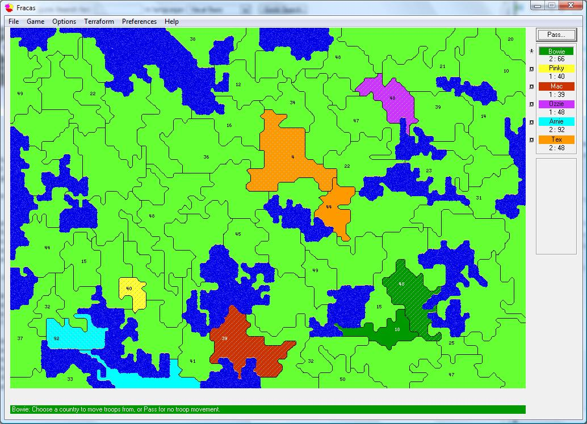



## Fracas Strategy Game

### Description

One of my favourite games, this is a strategy game written by Jason Merlo (and yes, I have his permission to post this here). The object of the game is to kill your opponents HQ while taking over as much land as possible to gain more troops. Up to 6-player network support. I have made some minor adjustments to the code originally posted by Jason (www.smozzie.com) to increase the speed and performance on all Winx based systems. Please note, that should this win any awards, they go to Jason not myself. Enjoy! Download is approx 4Mb.
 
### More Info
 

             |
---                |---
**Submitted On**   |2007-10-12 13:05:50
**By**             |[Eric O'Sullivan](https://github.com/Planet-Source-Code/PSCIndex/blob/master/ByAuthor/eric-o-sullivan.md)
**Level**          |Advanced
**User Rating**    |5.0 (20 globes from 4 users)
**Compatibility**  |VB 6\.0
**Category**       |[Games](https://github.com/Planet-Source-Code/PSCIndex/blob/master/ByCategory/games__1-38.md)
**World**          |[Visual Basic](https://github.com/Planet-Source-Code/PSCIndex/blob/master/ByWorld/visual-basic.md)
**Archive File**   |[Fracas20867210102007\.zip](https://github.com/Planet-Source-Code/eric-o-sullivan-fracas-strategy-game__1-69474/archive/master.zip)

